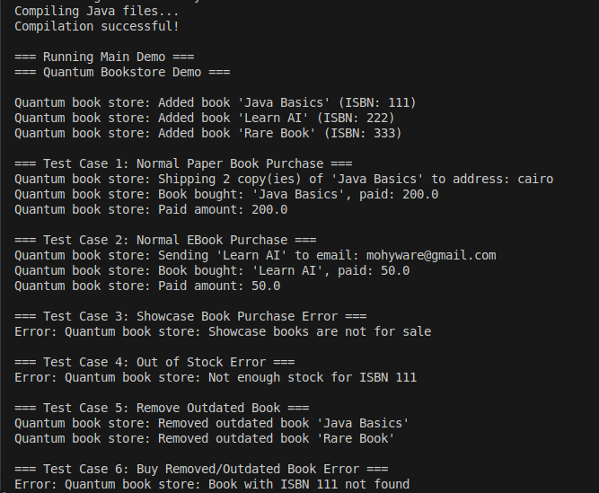

# Quantum Bookstore

A Java-based online bookstore system that demonstrates object-oriented programming concepts with book management, inventory control, and purchase processing for different types of books.

## Screenshot





## Features

- **Book Management**: Support for Paper Books, E-Books, and Showcase Books
- **Inventory Control**: Add/remove books with stock management
- **Outdated Book Removal**: Automatic cleanup of old books
- **Error Handling**: Comprehensive validation for various scenarios

## Project Structure

```
src/main/java/com/fawry/QuantumBookstore/
├── Main.java                 # Main application entry point
├── model/                    # Data models
│   ├── Book.java            # Abstract base book class
│   ├── PaperBook.java       # Physical books with stock
│   ├── EBook.java           # Digital books with file type
│   └── ShowcaseBook.java    # Demo books (not for sale)
└── service/                 # Business logic
    ├── QuantumBooksSystem.java # Main bookstore logic
    ├── MailService.java     # Email delivery service
    └── ShippingService.java # Shipping service
```

## How to Build and Run

### Prerequisites
- Java 8 or higher
- Bash shell (for build script)

### Quick Start
1. Clone or download the project
2. Make the build script executable:
   ```bash
   chmod +x build.sh
   ```
3. Run the build script:
   ```bash
   ./build.sh
   ```

## Demo Scenarios

The application includes several test scenarios that demonstrate:

1. **Normal Paper Book Purchase**: Successful purchase of physical books with shipping
2. **Normal E-Book Purchase**: Successful purchase of digital books with email delivery
3. **Showcase Book Purchase Error**: Attempting to buy demo books (not allowed)
4. **Out of Stock Error**: Trying to buy more books than available
5. **Remove Outdated Books**: Automatic removal of books older than specified years
6. **Buy Removed Book Error**: Attempting to purchase books that were removed as outdated

## Book Types

- **Paper Books**: Physical books with stock quantity, require shipping address
- **E-Books**: Digital books with file type, require email address
- **Showcase Books**: Demo books for display only, cannot be purchased

